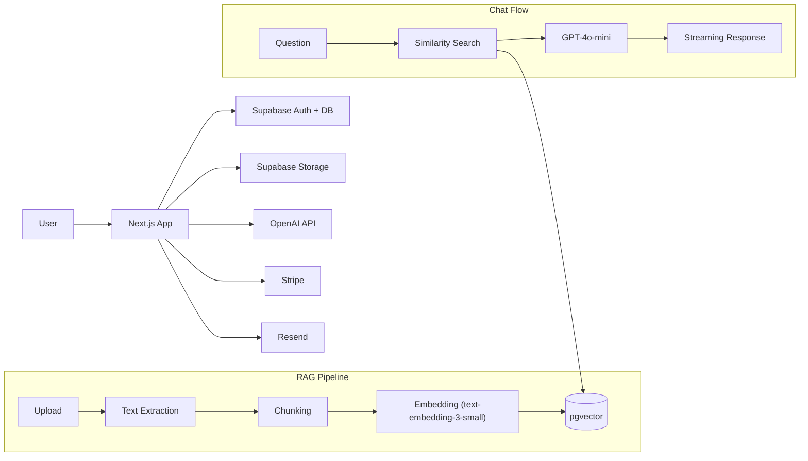

# DocChat

> Upload documents. Ask questions. Get AI-powered answers with source citations.

[](https://nextjs.org/)
[](https://www.typescriptlang.org/)
[](https://supabase.com/)
[](https://openai.com/)
[](https://stripe.com/)
[](https://tailwindcss.com/)

## Why This Exists

Reading long documents is slow. Searching through PDFs is painful. DocChat lets you upload a PDF, DOCX, or TXT file and have a conversation with it -- ask questions in plain language and get accurate answers with exact page citations, so you can verify every response.

## Quick Start

```bash
# 1. Clone and install
git clone https://github.com/Docat0209/DocChat.git
cd DocChat
npm install

# 2. Configure environment
cp .env.local.example .env.local
# Fill in your API keys (see Environment Variables below)

# 3. Run the database migrations, then start the dev server
# (see Database Setup below for migration instructions)
npm run dev
```

Open [http://localhost:3000](http://localhost:3000) and upload your first document.

## Features

- **Document Upload** -- PDF, DOCX, and TXT files up to 20 MB
- **AI-Powered Q&A** -- ask questions in natural language, get answers grounded in your document
- **Source Citations** -- every answer cites the exact page so you can verify the information
- **Streaming Responses** -- answers appear word by word in real time
- **Chat History** -- revisit past conversations per document
- **Suggested Questions** -- auto-generated starter questions after each upload
- **Free / Pro Tiers** -- free tier (3 docs, 20 questions/day) or Pro ($9/month, unlimited)
- **Authentication** -- Google OAuth and email/password via Supabase Auth
- **Dark Mode** -- dark by default with system theme support

## Tech Stack

| Layer     | Technology                                                  |
| --------- | ----------------------------------------------------------- |
| Frontend  | Next.js 16, React 19, TypeScript, Tailwind CSS 4, shadcn/ui |
| Auth + DB | Supabase (PostgreSQL, Auth, Storage)                        |
| Vector DB | pgvector (Supabase extension)                               |
| LLM       | OpenAI GPT-4o-mini                                          |
| RAG       | LangChain.js + Vercel AI SDK                                |
| Payments  | Stripe (Checkout, Customer Portal, Webhooks)                |
| Email     | Resend                                                      |
| Testing   | Vitest, Testing Library                                     |
| CI/CD     | GitHub Actions                                              |
| Deploy    | Vercel                                                      |

## Architecture



**How it works:**

1. You upload a document. The server extracts text, splits it into chunks, generates embeddings with OpenAI, and stores them in pgvector.
2. You ask a question. The server embeds your query, finds the most relevant chunks via cosine similarity, and sends them as context to GPT-4o-mini.
3. The model streams an answer back with `[Page X]` citations so you can verify every claim.

## Environment Variables

Copy the example file and fill in each value:

```bash
cp .env.local.example .env.local
```

| Variable                             | Description                                  | Where to Get It                                                      |
| ------------------------------------ | -------------------------------------------- | -------------------------------------------------------------------- |
| `OPENAI_API_KEY`                     | OpenAI API key (server-side only)            | [platform.openai.com/api-keys](https://platform.openai.com/api-keys) |
| `NEXT_PUBLIC_SUPABASE_URL`           | Supabase project URL                         | Supabase Dashboard > Settings > API                                  |
| `NEXT_PUBLIC_SUPABASE_ANON_KEY`      | Supabase anonymous/public key                | Supabase Dashboard > Settings > API                                  |
| `SUPABASE_SERVICE_ROLE_KEY`          | Supabase service role key (server-side only) | Supabase Dashboard > Settings > API                                  |
| `STRIPE_SECRET_KEY`                  | Stripe secret key                            | [dashboard.stripe.com/apikeys](https://dashboard.stripe.com/apikeys) |
| `STRIPE_WEBHOOK_SECRET`              | Stripe webhook signing secret                | Stripe Dashboard > Webhooks                                          |
| `NEXT_PUBLIC_STRIPE_PUBLISHABLE_KEY` | Stripe publishable key                       | [dashboard.stripe.com/apikeys](https://dashboard.stripe.com/apikeys) |
| `STRIPE_PRICE_ID_PRO`                | Stripe Price ID for the Pro plan             | Stripe Dashboard > Products (see Stripe Setup)                       |
| `NEXT_PUBLIC_APP_URL`                | Your app URL                                 | `http://localhost:3000` for local dev                                |
| `RESEND_API_KEY`                     | Resend API key for transactional email       | [resend.com/api-keys](https://resend.com/api-keys)                   |

> **Security note:** Variables prefixed with `NEXT_PUBLIC_` are exposed to the browser. All other keys remain server-side only.

## Database Setup

1. **Create a Supabase project** at [supabase.com](https://supabase.com).

2. **Enable the pgvector extension.** Go to Database > Extensions and enable `vector`.

3. **Run the migration files** in the Supabase SQL Editor. Execute each file in order:

   ```
   supabase/migrations/00001_initial_schema.sql   -- tables, indexes, triggers
   supabase/migrations/00002_storage.sql           -- storage bucket + policies
   supabase/migrations/00003_match_documents.sql   -- similarity search function
   supabase/migrations/00004_rls_policies.sql      -- row-level security
   ```

   Open the SQL Editor in your Supabase Dashboard, paste the contents of each file, and run them sequentially.

4. **Enable Google OAuth** (optional). Go to Authentication > Providers > Google, enable it, and add your Google OAuth client ID and secret. Set the redirect URL to `https://<your-supabase-ref>.supabase.co/auth/v1/callback`.

## Stripe Setup

1. **Create a product** in the [Stripe Dashboard](https://dashboard.stripe.com/products). Name it "Pro" with a recurring price of $9/month.

2. **Copy the Price ID** (starts with `price_`) and set it as `STRIPE_PRICE_ID_PRO` in your `.env.local`.

3. **Create a webhook endpoint.** For production, point it to `https://yourdomain.com/api/stripe/webhook`. For local development, use the Stripe CLI:

   ```bash
   # Install the Stripe CLI, then:
   stripe listen --forward-to localhost:3000/api/stripe/webhook
   ```

   Copy the webhook signing secret (`whsec_...`) and set it as `STRIPE_WEBHOOK_SECRET`.

4. **Subscribe to these webhook events:**
   - `checkout.session.completed`
   - `customer.subscription.updated`
   - `customer.subscription.deleted`

## Development

```bash
npm run dev          # Start the development server on port 3000
npm test             # Run all tests (Vitest)
npm run test:watch   # Run tests in watch mode
npm run lint         # Lint with ESLint + Prettier
npm run build        # Production build
```

## Project Structure

```
src/
  app/
    (app)/              # Authenticated app routes (sidebar layout)
      chat/[documentId] # Chat page per document
    api/
      chat/             # Chat streaming endpoint (POST)
      chats/            # Chat history CRUD
      documents/        # Document CRUD + upload
      email/            # Welcome email endpoint
      stripe/           # Checkout, portal, webhook
      usage/            # Usage limits endpoint
    auth/callback/      # OAuth callback handler
    login/              # Login page
    signup/             # Signup page
    page.tsx            # Landing page
  components/
    chat/               # Chat UI components (messages, input, citations)
    sidebar/            # Document sidebar (upload, list, delete)
    ui/                 # shadcn/ui primitives
  lib/
    auth/               # Authentication helpers
    email/              # Email templates (Resend)
    extraction/         # Text extraction (PDF, DOCX, TXT)
    pipeline/           # Document processing (chunk + embed)
    rag/                # Retrieval (similarity search)
    stripe/             # Stripe client helpers
    supabase/           # Supabase client (browser + server + admin)
    usage/              # Usage tracking and limit checks
  types/                # TypeScript type definitions
supabase/
  migrations/           # SQL migration files (run in order)
```

## Testing

The project includes 97+ tests across 20 test files covering API routes, RAG pipeline, UI components, and utility functions.

```bash
# Run all tests
npm test

# Run in watch mode during development
npm run test:watch
```

Tests use **Vitest** with **Testing Library** for component tests and **jsdom** for DOM simulation.

## Deployment

### Vercel (Recommended)

1. Push your repository to GitHub.
2. Import the project in [Vercel](https://vercel.com/new).
3. Add all environment variables from your `.env.local` to the Vercel project settings (Settings > Environment Variables). Update `NEXT_PUBLIC_APP_URL` to your production URL.
4. Update your Stripe webhook endpoint to point to your production URL (`https://yourdomain.com/api/stripe/webhook`).
5. Update the Google OAuth redirect URL in Supabase to include your production domain.
6. Deploy.

### CI Pipeline

Every pull request to `dev` or `main` runs the full CI pipeline via GitHub Actions:

- **Lint** -- ESLint + Prettier
- **Type Check** -- `tsc --noEmit`
- **Tests** -- Vitest
- **Build** -- Next.js production build

All four checks must pass before merging.

## License

MIT
